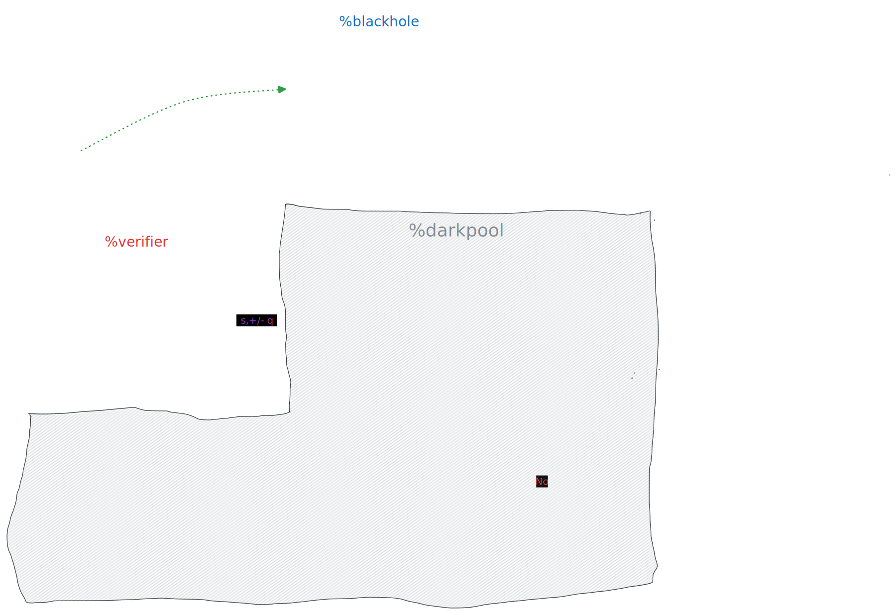

# Questions/Blockers

## `darkpool/app/darkpool.hoon` is the main file

1. When a new order comes in on the `++on-poke` arm of `%darkpool`, need to check if a match. Best way? `|-` trap in a `++cross` arm? Logic:

   - Does `p(n)=p(0,1,...n-1)`? If yes, does `t(n)!=t(match)`? Then a match.

2. Generate a random number for each order as `id`.That is sent to `%darkpool` agent
3. Hardcode the `target` or `target.ord` to a ship on the `%blackhole` agent. Not working correctly
4. Once the matching logic is working, then you make two calls from the agent to the `-build-eden` thread:
   1. Pass in the the file name path
   2. Pass the input
5. With the Nock generated from the `-build-eden` calls, we now call the `-prove-eden` thread with that result
6. A `scry` to get out the proof and then send the proof to the two counter-party ships of the correctly matched trade.

---

## Orderflow

