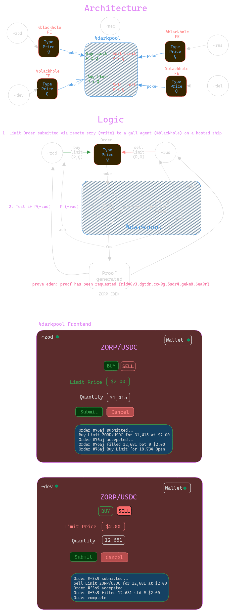

# `%blackhole`


## High Level Architecture

### Develop two gall agents :building_construction:

1. `%blackhole` - Front end on a ship that can send(write) and receive information from `%darkpool`.
2. `%darkpool` - An agent running on another ship that is a mock darkpool smart contract. This will match orders, send back acknowledgements and generate a proof of corresponding trades.

### User stories 🧑‍🤝‍🧑

A trader wants to submit a larger order to a darkpool without revealing incomplete information. The logic order:

1. Start the `%blackhole` agent on their ship
2. Wallet connect
3. The trader inputs `Type`, `Quantity` and `Price` and submits the order to the `%darkpool`
4. `%darkpool` is a gall agent on another ship that is a mock darkpool smart contract
5. Once an order is matched, `%darkpool` will acknowledge the trade to each party and submit a proof to Eden for computation
6. Once that proof is generated, each party to the trade will receive the proof.



---

## Local Desk development 🖥️

### `%blackhole` Agent

1. Boot a fake ship

   ```cli
   ./urbit -F zod
   ```

2. Create a `%blackhole` desk in the dojo

   ```cli
   > |mount %base
   > |merge %blackhole our %base
   > |mount %blackhole
   ```

3. Start a watcher in a new terminal, to sync the code into the fakeship

   ```cli
   watch rsync -zr --delete /location/of/blackhole/desk/* /path/to/fake/zod/blackhole
   ```

4. Commit and install `%blackhole` on the fakeship

   ```cli
   > |commit %blackhole
   > |install our %blackhole
   ```

### `%darkpool` Agent

1. Boot a fake ship `~dev`

   ```cli
   ./urbit -F dev
   ```

2. Create a `%darkpool` desk in the dojo

   ```cli
   > |mount %base
   > |merge %darkpool our %base
   > |mount %darkpool
   ```

3. Start a watcher in a new terminal, to sync the code into the fakeship

   ```cli
   watch rsync -zr --delete /location/of/darkpool/desk/* /path/to/fake/dev/darkpool
   ```

4. Commit and install `%darkpool` on the fakeship

   ```cli
   > |commit %darkpool
   > |install our %darkpool
   ```

* [Urbit Developer Environment Setup](https://developers.urbit.org/guides/core/environment)

---

## UI 👓

Clone this repo, switch to the `ui` directory and run:

```cli
npm install
```

then

```cli
npm start
```

---

### Learn More

To learn app development on Urbit and Zorp, follow the guides here:

* [Urbit Developers](https://developers.urbit.org)
* [Zorp](https://www.zorp.io)
* [Eden Whitepaper](https://github.com/zorp-corp/whitepaper/blob/main/eden.pdf)
